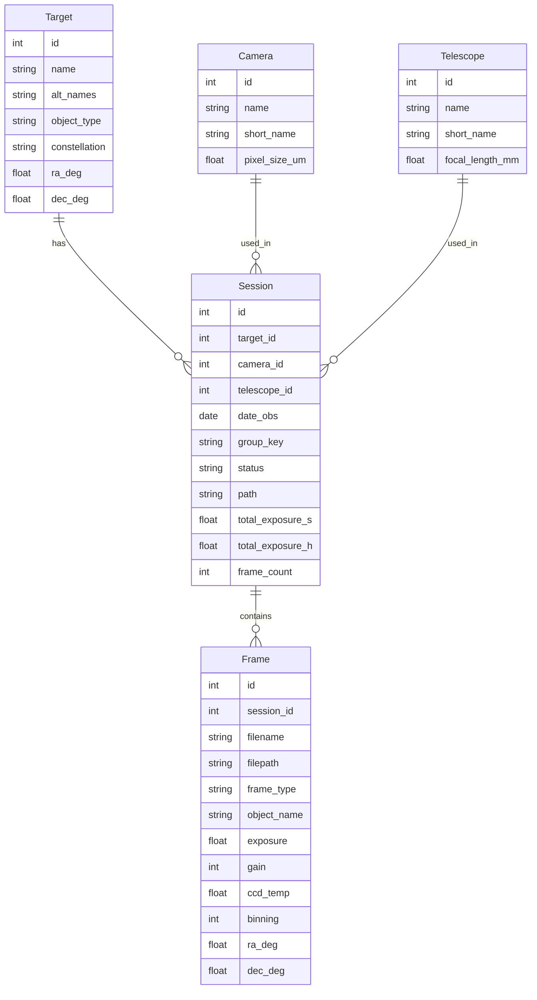

# Architecture

## Overview

StellaShelf is a three-tier application:

1. **Scanner** — walks the filesystem, reads FITS/XISF headers, populates the database
2. **API** — FastAPI REST + WebSocket backend serving the database
3. **UI** — Vue 3 + Vite frontend for browsing, searching, and triggering pipelines

## Data Model



## Scanner Pipeline

```
Scan Directory
    │
    ├─► Find *.fit, *.fits, *.FIT, *.FITS, *.xisf files
    │
    ├─► Read FITS header (primary + first extension)
    │   └─► Extract: OBJECT, INSTRUME, TELESCOP, FILTER, EXPOSURE,
    │       DATE-OBS, GAIN, CCD-TEMP, XBINNING, IMAGETYP, etc.
    │
    ├─► Fallback: parse filename convention
    │   └─► Pattern: {OBJECT}_{FILTER}_{EXPOSURE}s_{BINNING}_{TEMP}_{GAIN}_{SEQ}.fit
    │
    ├─► Group into Session
    │   └─► GROUP BY: (object, date_obs[:10], instrument, telescope, filter)
    │
    ├─► Calculate totals
    │   └─► total_exposure = sum(exposure × frame_count) per session
    │
    └─► Write to SQLite + FTS5 index
```

## Observed Data Structures

### Directory Layout (per user)

```
Camera/
  ├── master calibration (darks, bias, flats)
  │   ├── masterbias_1x1_100x_gain_0_-20C.fit
  │   └── masterdark_300s_1x1_100x_gain_0_-20C.fit
  └── Telescope/
      └── Object/
          └── Date/
              └── Light frames
```

Example: `/mnt/data/Astro/astro/ASI294MMPro/_140PH/M33/2020-11-23/M33_L_300sec_1x1_-20C_gain_120_0001.fit`

### FITS Header (SGP format, compressed)

Key headers live in the **first extension** (HDU[1]) when the file is gzip-compressed:

- `OBJECT`: Target name (e.g., "M33")
- `INSTRUME`: Camera name (e.g., "ASI Camera (1)")
- `TELESCOP`: Telescope/mount (e.g., "POTH Hub")
- `FILTER`: Filter name (e.g., "L", "Ha", "OIII")
- `EXPOSURE`: Exposure time in seconds
- `GAIN`: Camera gain setting
- `CCD-TEMP`: Cooler temperature
- `DATE-OBS`: UTC observation datetime
- `DATE-LOC`: Local observation datetime
- `IMAGETYP`: Frame type (LIGHT, DARK, FLAT, BIAS)
- `FOCALLEN`: Focal length in mm
- `XPIXSZ` / `YPIXSZ`: Pixel size in microns
- `SITENAME`: Observation site
- `CREATOR`: Capture software (e.g., "Sequence Generator Pro")

## Technology Stack

| Component | Technology | Rationale |
|---|---|---|
| Backend | FastAPI | Async, WebSocket, native FITS support via astropy |
| Database | SQLite + FTS5 | Zero-server, portable, fast enough for personal use |
| Frontend | Vue 3 + Vite + PrimeVue | Reactive UI, rich table components |
| FITS reader | astropy.io.fits | Gold standard, handles compressed FITS |
| RAW reader | rawpy | Canon CR2/CR3, Nikon NEF |
| Platesolver | ASTAP CLI | Arm64 + x64, fast, offline |
| Stacking | Siril CLI | Full pipeline, GPU-accelerated via OpenCL |
| Linting | Ruff | Fast, comprehensive Python linter |
| Testing | pytest + pytest-cov | Standard, well-supported |

## Deployment

- **Development**: Local on RK3588, hot-reload
- **Production**: Docker on 192.168.1.100 (Kubuntu, AMD 5900X + RX 9070), data mounted via NFS
- **Processing**: Siril runs on the workstation with GPU acceleration

## Service Architecture

```
src/stellashelf/
├── scanner.py      # FITS header extraction, session grouping, thumbnail generation, platesolving
├── db.py           # SQLAlchemy models (Target, Session, Frame, Camera, Telescope, CalibrationFile, Setting)
├── importer.py     # Centralized import pipeline (CLI & API)
├── cli.py          # Click CLI commands
├── api.py          # FastAPI REST API (20+ endpoints) + Vue 3 SPA serving
└── config.py       # Centralized configuration (paths, defaults)

frontend-vue/
└── src/
    ├── views/      # 11 Vue views: Dashboard, Targets, TargetDetail, Sessions, SessionDetail,
    │               #   Equipment, Search, Scan, Settings, Platesolve, Help
    ├── stores/     # 3 Pinia stores: api (HTTP client), scan (scan progress), theme (dark/light)
    ├── components/ # Reusable: StatCard, Pagination
    └── router/     # Vue Router with 11 routes
```

The `ImporterService` in `importer.py` centralizes all import logic, eliminating duplication between CLI and API. Both interfaces delegate to this service, ensuring consistent behavior and easier maintenance.

### API Endpoints

| Endpoint | Method | Description |
|----------|--------|-------------|
| `/api/v1/health` | GET | Health check and database path |
| `/api/v1/dashboard` | GET | Aggregated dashboard data |
| `/api/v1/search?q=...` | GET | Full-text search via FTS5 |
| `/api/v1/targets` | GET | List targets (paginated, filterable by type/constellation) |
| `/api/v1/targets/types` | GET | Distinct object types and constellations for filter dropdowns |
| `/api/v1/targets/{id}` | GET | Target details |
| `/api/v1/targets/{id}/sessions` | GET | Sessions for a target |
| `/api/v1/targets/{id}/thumbnails` | GET | Recent frame thumbnails |
| `/api/v1/sessions` | GET | List sessions (paginated, filterable) |
| `/api/v1/sessions/{id}` | GET | Session details |
| `/api/v1/sessions/{id}/stats` | GET | Per-filter and per-type aggregates |
| `/api/v1/frames` | GET | List frames (paginated, filterable, `has_coordinates`) |
| `/api/v1/frames/{id}/thumbnail` | GET | JPEG thumbnail |
| `/api/v1/cameras` | GET | Cameras with usage stats |
| `/api/v1/telescopes` | GET | Telescopes with usage stats |
| `/api/v1/filters` | GET | Filter usage statistics |
| `/api/v1/stats` | GET | Database statistics |
| `/api/v1/scan` | POST | Start background scan |
| `/api/v1/scan/status` | GET | Scan progress |
| `/api/v1/platesolve` | POST | Run ASTAP platesolving |
| `/api/v1/settings` | GET/POST | Application configuration |

### Frontend Routes

| Route | View | Description |
|-------|------|-------------|
| `/` | Dashboard | Stats, top targets, recent sessions, ECharts bar chart |
| `/targets` | Targets | Filterable/sortable target list with badges |
| `/targets/:id` | TargetDetail | Target info, thumbnails, session list |
| `/sessions` | Sessions | Filterable/sortable session list |
| `/sessions/:id` | SessionDetail | Frame list with pagination, filtering, aggregates |
| `/equipment` | Equipment | Tabs: cameras, telescopes, filters — sortable |
| `/search` | Search | FTS5 full-text search with tabbed results |
| `/scan` | Scan | Directory scanner with live progress |
| `/settings` | Settings | Config tabs: general (paths/theme/ASTAP), equipment overrides |
| `/platesolve` | Platesolve | ASTAP platesolving runner |
| `/help` | Help | Documentation and keyboard shortcuts |

### Frontend State Management

- **`api` store**: Centralized HTTP client with loading/error state
- **`scan` store**: Real-time scan progress polling (500ms interval)
- **`theme` store**: Dark/Light/System theme with localStorage persistence