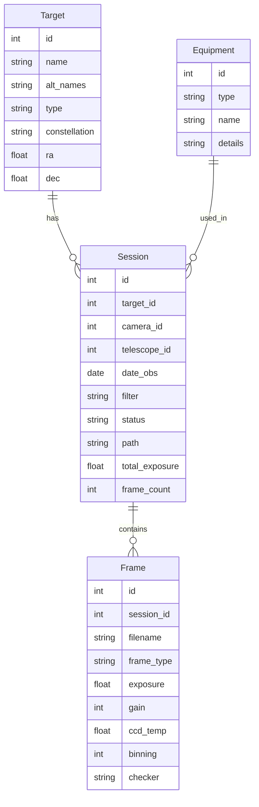

# Architecture

## Overview

StellaShelf is a three-tier application:

1. **Scanner** — walks the filesystem, reads FITS/XISF headers, populates the database
2. **API** — FastAPI REST + WebSocket backend serving the database
3. **UI** — Vue 3 + Vite frontend for browsing, searching, and triggering pipelines

## Data Model



## Scanner Pipeline

```
Scan Directory
    │
    ├─► Find *.fit, *.fits, *.FIT, *.FITS, *.xisf files
    │
    ├─► Read FITS header (primary + first extension)
    │   └─► Extract: OBJECT, INSTRUME, TELESCOP, FILTER, EXPOSURE,
    │       DATE-OBS, GAIN, CCD-TEMP, XBINNING, IMAGETYP, etc.
    │
    ├─► Fallback: parse filename convention
    │   └─► Pattern: {OBJECT}_{FILTER}_{EXPOSURE}s_{BINNING}_{TEMP}_{GAIN}_{SEQ}.fit
    │
    ├─► Group into Session
    │   └─► GROUP BY: (object, date_obs[:10], instrument, telescope, filter)
    │
    ├─► Calculate totals
    │   └─► total_exposure = sum(exposure × frame_count) per session
    │
    └─► Write to SQLite + FTS5 index
```

## observed Data Structures

### Directory Layout (per user)

```
Camera/
  ├── master calibration (darks, bias, flats)
  │   ├── masterbias_1x1_100x_gain_0_-20C.fit
  │   └── masterdark_300s_1x1_100x_gain_0_-20C.fit
  └── Telescope/
      └── Object/
          └── Date/
              └── Light frames
```

Example: `/mnt/data/Astro/astro/ASI294MMPro/_140PH/M33/2020-11-23/M33_L_300sec_1x1_-20C_gain_120_0001.fit`

### FITS Header (SGP format, compressed)

Key headers live in the **first extension** (HDU[1]) when the file is gzip-compressed:

- `OBJECT`: Target name (e.g., "M33")
- `INSTRUME`: Camera name (e.g., "ASI Camera (1)")
- `TELESCOP`: Telescope/mount (e.g., "POTH Hub")
- `FILTER`: Filter name (e.g., "L", "Ha", "OIII")
- `EXPOSURE`: Exposure time in seconds
- `GAIN`: Camera gain setting
- `CCD-TEMP`: Cooler temperature
- `DATE-OBS`: UTC observation datetime
- `DATE-LOC`: Local observation datetime
- `IMAGETYP`: Frame type (LIGHT, DARK, FLAT, BIAS)
- `FOCALLEN`: Focal length in mm
- `XPIXSZ` / `YPIXSZ`: Pixel size in microns
- `SITENAME`: Observation site
- `CREATOR`: Capture software (e.g., "Sequence Generator Pro")

## Technology Stack

| Component | Technology | Rationale |
|---|---|---|
| Backend | FastAPI | Async, WebSocket, native FITS support via astropy |
| Database | SQLite + FTS5 | Zero-server, portable, fast enough for personal use |
| Frontend | Vue 3 + Vite + PrimeVue | Reactive UI, rich table components |
| FITS reader | astropy.io.fits | Gold standard, handles compressed FITS |
| RAW reader | rawpy | Canon CR2/CR3, Nikon NEF |
| Platesolver | ASTAP CLI | Arm64 + x64, fast, offline |
| Stacking | Siril CLI | Full pipeline, GPU-accelerated via OpenCL |
| Linting | Ruff | Fast, comprehensive Python linter |
| Testing | pytest + pytest-cov | Standard, well-supported |

## Deployment

- **Development**: Local on RK3588, hot-reload
- **Production**: Docker on 192.168.1.100 (Kubuntu, AMD 5900X + RX 9070), data mounted via NFS
- **Processing**: Siril runs on the workstation with GPU acceleration

## Service Architecture

```
src/stellashelf/
├── scanner.py      # FITS header extraction, session grouping
├── db.py           # SQLAlchemy models (Target, Session, Frame, Camera, Telescope)
├── importer.py     # Centralized import pipeline (CLI & API)
├── cli.py          # Click CLI commands
└── api.py          # FastAPI REST API + Vue 3 SPA serving
```

The `ImporterService` in `importer.py` centralizes all import logic, eliminating duplication between CLI and API. Both interfaces delegate to this service, ensuring consistent behavior and easier maintenance.